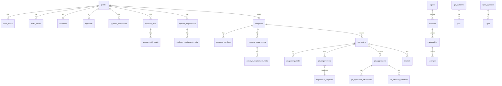

# AGSURJOBS — Database Agent

> **Purpose**: This document is the authoritative reference for the AGSURJOBS database architecture.
> Any AI agent writing queries, creating types, or modifying schema-related code MUST follow these rules.

---

## 1. Database Overview

| Property            | Value                                                   |
| ------------------- | ------------------------------------------------------- |
| **Provider**        | Supabase (managed PostgreSQL)                            |
| **Project ID**      | `otixooaxfcvjgrlaxihj`                                  |
| **Schemas**         | 7: `public`, `core`, `applicants`, `employers`, `jobs`, `system`, `esmdd` |
| **Type Generation** | Auto-generated via `npm run types:gen`                   |
| **Type File**       | [`src/types/database.types.ts`](file:///c:/Users/Denmark%20B.%20Rivera/OneDrive/Documents/Work/vue-agsurjobs/src/types/database.types.ts) (1803 lines, DO NOT EDIT) |
| **Access Pattern**  | Supabase JS client with typed multi-schema queries       |
| **Security**        | Row Level Security (RLS) on all tables                   |

---

## 2. Schema Architecture

```
┌─────────────────────────────────────────────────────────────────┐
│                        PostgreSQL Instance                       │
│                                                                  │
│  ┌──────────┐  ┌──────────┐  ┌────────────┐  ┌──────────────┐  │
│  │  public   │  │   core   │  │ applicants │  │  employers   │  │
│  │ (shared)  │  │ (users)  │  │ (job       │  │ (companies)  │  │
│  │           │  │          │  │  seekers)  │  │              │  │
│  └──────────┘  └──────────┘  └────────────┘  └──────────────┘  │
│                                                                  │
│  ┌──────────┐  ┌──────────┐  ┌────────────┐                     │
│  │   jobs   │  │  system  │  │   esmdd    │                     │
│  │ (hiring) │  │ (audit/  │  │ (PESO     │                     │
│  │          │  │  notif)  │  │  programs) │                     │
│  └──────────┘  └──────────┘  └────────────┘                     │
└─────────────────────────────────────────────────────────────────┘
```

---

## 3. Schema: `public` — Shared Reference Data

The `public` schema contains reference data shared across all roles.

### Tables

#### `regions`
Philippine regions (PSGC).

| Column       | Type      | Constraints    |
| ------------ | --------- | -------------- |
| `id`         | `uuid`    | PK, default    |
| `code`       | `text`    | NOT NULL       |
| `name`       | `text`    | NOT NULL       |
| `created_at` | `timestamptz` | nullable   |

#### `provinces`
Philippine provinces linked to regions.

| Column       | Type      | Constraints       |
| ------------ | --------- | ----------------- |
| `id`         | `uuid`    | PK, default       |
| `code`       | `text`    | NOT NULL          |
| `name`       | `text`    | NOT NULL          |
| `region_id`  | `uuid`    | FK → `regions.id` |
| `created_at` | `timestamptz` | nullable      |

#### `municipalities`
Philippine municipalities/cities linked to provinces.

| Column        | Type      | Constraints          |
| ------------- | --------- | -------------------- |
| `id`          | `uuid`    | PK, default          |
| `code`        | `text`    | NOT NULL             |
| `name`        | `text`    | NOT NULL             |
| `province_id` | `uuid`    | FK → `provinces.id`  |
| `is_city`     | `boolean` | nullable             |
| `created_at`  | `timestamptz` | nullable         |

#### `barangays`
Philippine barangays with LPII terrain classification.

| Column            | Type        | Constraints                |
| ----------------- | ----------- | -------------------------- |
| `id`              | `uuid`      | PK, default                |
| `code`            | `text`      | NOT NULL                   |
| `name`            | `text`      | NOT NULL                   |
| `municipality_id` | `uuid`      | FK → `municipalities.id`   |
| `lpii_tag`        | `lpii_type` | enum: `LOWLAND`, `UPLAND`, `WETLAND` |
| `created_at`      | `timestamptz` | nullable                 |

#### `requirement_templates`
Defines document requirement types for applicants and employers.

| Column             | Type   | Constraints   |
| ------------------ | ------ | ------------- |
| `id`               | `int4` | PK, serial    |
| `name`             | `text` | nullable      |
| `requirement_type` | `text` | nullable      |
| `description`      | `text` | nullable      |
| `created_at`       | `timestamptz` | default |
| `updated_at`       | `timestamptz` | nullable |

#### `document_templates`
Downloadable document templates categorized by role.

| Column        | Type      | Constraints      |
| ------------- | --------- | ---------------- |
| `id`          | `int4`    | PK, serial       |
| `title`       | `text`    | NOT NULL         |
| `description` | `text`    | nullable         |
| `category`    | `text`    | nullable         |
| `target_role` | `text`    | nullable         |
| `file_name`   | `text`    | nullable         |
| `file_path`   | `text`    | nullable         |
| `file_size`   | `int4`    | nullable         |
| `mime_type`   | `text`    | nullable         |
| `is_active`   | `boolean` | nullable         |
| `created_at`  | `timestamptz` | nullable     |
| `updated_at`  | `timestamptz` | nullable     |

#### `job_posting`
Job listings created by employers.

| Column                 | Type             | Constraints |
| ---------------------- | ---------------- | ----------- |
| `id`                   | `int4`           | PK, serial  |
| `employer_id`          | `int4`           | nullable    |
| `job_title`            | `text`           | nullable    |
| `job_description`      | `text`           | nullable    |
| `job_type`             | `text`           | nullable    |
| `location`             | `text`           | nullable    |
| `salary_min`           | `numeric`        | nullable    |
| `salary_max`           | `numeric`        | nullable    |
| `education_required`   | `text`           | nullable    |
| `experience_required`  | `text`           | nullable    |
| `vacancies`            | `int4`           | nullable    |
| `work_setup`           | `text`           | nullable    |
| `application_deadline` | `timestamptz`    | nullable    |
| `status`               | `job_status_type`| nullable    |

#### `job_posting_media`
Media attachments for job postings.

| Column           | Type   | FK                          |
| ---------------- | ------ | --------------------------- |
| `id`             | `int4` | PK, serial                  |
| `job_posting_id` | `int4` | FK → `job_posting.id`       |
| `path`, `filename`, `mime_type`, `size`, `alt_text`, `description` | various | nullable |

#### `job_requirements`
Requirement templates linked to specific job postings.

| Column                   | Type   | FK                                   |
| ------------------------ | ------ | ------------------------------------ |
| `id`                     | `int4` | PK, serial                           |
| `job_posting_id`         | `int4` | FK → `job_posting.id`                |
| `requirement_id`         | `int4` | FK → `requirement_templates.id`      |
| `additional_requirement` | `text` | nullable                             |

### Public Functions

| Function                | Args                    | Returns   | Purpose                      |
| ----------------------- | ----------------------- | --------- | ---------------------------- |
| `check_if_email_exists` | `target_email: text`    | `boolean` | Email uniqueness check (SECURITY DEFINER) |

### Public Enums

| Enum Name                | Values                                                          |
| ------------------------ | --------------------------------------------------------------- |
| `application_stage_type` | `applied`, `screened`, `interviewing`, `offered`, `hired`, `rejected` |
| `company_role_type`      | `owner`, `admin`, `hr`, `employee`                              |
| `gender_type`            | `male`, `female`, `non-binary`, `prefer_not_to_say`             |
| `job_status_type`        | `draft`, `active`, `paused`, `closed`                           |
| `lpii_type`              | `LOWLAND`, `UPLAND`, `WETLAND`                                  |
| `notification_type`      | `application_status`, `interview_alert`, `referral_update`, `compliance_alert`, `system_announcement` |
| `referral_outcome_type`  | `pending_feedback`, `hired`, `rejected`, `no_show`              |
| `status_type`            | `pending`, `approved`, `rejected`, `active`, `closed`           |
| `user_role`              | `applicant`, `employer`, `peso_staff`, `admin`                  |

---

## 4. Schema: `core` — User Profiles & Identity

The `core` schema manages user identity, profiles, and media.

### Tables

#### `profiles`
Central user table — one row per authenticated user.

| Column           | Type           | Constraints                |
| ---------------- | -------------- | -------------------------- |
| `id`             | `uuid`         | PK (matches `auth.users.id`) |
| `firstname`      | `text`         | nullable                   |
| `middlename`     | `text`         | nullable                   |
| `lastname`       | `text`         | nullable                   |
| `username`       | `text`         | nullable                   |
| `birthdate`      | `date`         | nullable                   |
| `gender`         | `gender_type`  | enum (core)                |
| `contact_number` | `text`         | nullable                   |
| `civil_status`   | `text`         | nullable                   |
| `religion`       | `text`         | nullable                   |
| `height`         | `text`         | nullable                   |
| `region`         | `text`         | nullable                   |
| `province`       | `text`         | nullable                   |
| `geographic`     | `text`         | nullable (municipality)    |
| `barangay`       | `text`         | nullable                   |
| `role`           | `user_role`    | enum (core)                |
| `status`         | `status_type`  | enum (core)                |
| `is_pwd`         | `boolean`      | nullable                   |
| `is_4ps`         | `boolean`      | nullable                   |
| `last_login`     | `timestamptz`  | nullable                   |
| `created_at`     | `timestamptz`  | default                    |
| `updated_at`     | `timestamptz`  | nullable                   |

#### `profile_media`
User avatar/photo uploads.

| Column       | Type   | FK                       |
| ------------ | ------ | ------------------------ |
| `id`         | `int4` | PK, serial               |
| `profile_id` | `uuid` | FK → `profiles.id`      |
| `path`, `filename`, `mime_type`, `size`, `alt_text`, `description` | various | nullable |

#### `profile_socials`
User social media links.

| Column        | Type   | FK                  |
| ------------- | ------ | ------------------- |
| `id`          | `int4` | PK, serial          |
| `profile_id`  | `uuid` | FK → `profiles.id`  |
| `social_name` | `text` | nullable            |
| `social_link` | `text` | nullable            |

#### `biometrics`
Face embeddings for biometric verification.

| Column            | Type   | FK                           |
| ----------------- | ------ | ---------------------------- |
| `id`              | `int4` | PK, serial                   |
| `user_id`         | `uuid` | FK → `profiles.id` (1-to-1) |
| `biometric_type`  | `text` | nullable                     |
| `face_embedding`  | `text` | nullable                     |
| `registered_at`   | `timestamptz` | default               |

### Core Functions

| Function           | Returns                         | Purpose                    |
| ------------------ | ------------------------------- | -------------------------- |
| `get_user_emails`  | `{email: text, id: uuid}[]`     | Fetch all emails from `auth.users` (SECURITY DEFINER) |

### Core Enums

| Enum Name      | Values                                                                     |
| -------------- | -------------------------------------------------------------------------- |
| `gender_type`  | `woman`, `man`, `cisgender_woman`, `cisgender_man`, `transgender_woman`, `transgender_man`, `non_binary`, `genderqueer`, `genderfluid`, `agender`, `two_spirit`, `intersex`, `different_identity`, `prefer_not_to_say` |
| `status_type`  | `pending`, `approved`, `rejected`, `active`, `inactive`                    |
| `user_role`    | `admin`, `applicant`, `company_owner`, `company_member`, `provincial_peso`, `municipal_peso`, `dole` |

> [!WARNING]
> Note the `core.user_role` enum has **different values** from `public.user_role`. The `core` enum is the canonical one used by `profiles.role`.

---

## 5. Schema: `applicants` — Job Seeker Data

### Tables

#### `applicants`
Full applicant profile with DOLE SIF-compliant fields.

| Key Fields                    | Type           | Notes                               |
| ----------------------------- | -------------- | ----------------------------------- |
| `id`                          | `uuid`         | PK                                  |
| `profile_id`                  | `uuid`         | FK → `core.profiles.id`            |
| `first_name`, `surname`, `middle_name`, `suffix` | `text` | Name fields             |
| `date_of_birth`               | `date`         | NOT NULL                            |
| `sex`, `civil_status`         | `text`         | nullable                            |
| `address`                     | `jsonb`        | Structured address object           |
| `employment_status`           | `text`         | nullable                            |
| `employment_type`             | `text`         | nullable                            |
| `educational_background`      | `jsonb`        | Array of education records          |
| `work_experiences`            | `jsonb`        | Array of work history               |
| `vocational_trainings`        | `jsonb`        | Array of training records           |
| `eligibilities`               | `jsonb`        | Array of eligibility records        |
| `language_proficiencies`      | `jsonb`        | Array of language skills            |
| `disabilities`                | `text[]`       | Array of disability types           |
| `is_4ps_beneficiary`          | `boolean`      | 4Ps program flag                    |
| `is_ofw`, `is_former_ofw`     | `boolean`      | OFW status flags                    |
| `preferred_occupations`       | `text[]`       | Job preferences                     |
| `preferred_local_locations`   | `text[]`       | Location preferences                |
| `referred_programs`           | `text[]`       | DOLE program referrals              |

#### `applicant_experiences`
Detailed work experience entries.

| Column        | Type   | FK                      |
| ------------- | ------ | ----------------------- |
| `id`          | `int4` | PK, serial              |
| `profile_id`  | `uuid` | FK → `core.profiles.id` |
| `job_title`   | `text` | nullable                |
| `company_name`| `text` | nullable                |
| `description` | `text` | NOT NULL                |
| `start_date`  | `date` | nullable                |
| `end_date`    | `date` | nullable                |

#### `applicant_skills`
Skills categorized by type.

| Column           | Type   | FK                      |
| ---------------- | ------ | ----------------------- |
| `id`             | `int4` | PK, serial              |
| `profile_id`     | `uuid` | FK → `core.profiles.id` |
| `skill_name`     | `text` | NOT NULL                |
| `skill_category` | `text` | NOT NULL                |

#### `applicant_skill_media`
Skill certification/proof uploads.

| Column              | Type   | FK                               |
| ------------------- | ------ | -------------------------------- |
| `id`                | `int4` | PK, serial                       |
| `applicant_skill_id`| `int4` | FK → `applicant_skills.id`       |
| `path`, `filename`, etc. | various | Standard media fields       |

#### `applicant_requirements`
Document verification submissions.

| Column           | Type          | FK/Notes                   |
| ---------------- | ------------- | -------------------------- |
| `id`             | `int4`        | PK, serial                 |
| `profile_id`     | `uuid`        | FK → `core.profiles.id`    |
| `requirement_id` | `int4`        | FK → requirement template  |
| `status`         | `status_type` | `pending/approved/rejected`|
| `remarks`        | `text`        | nullable                   |

#### `applicant_requirement_media`
Document upload media linked to requirements.

| Column                      | Type   | FK                                          |
| --------------------------- | ------ | ------------------------------------------- |
| `id`                        | `int4` | PK, serial                                  |
| `applicant_requirement_id`  | `int4` | FK → `applicant_requirements.id`            |
| `profiles_id`               | `uuid` | FK (note: `profiles_id` not `profile_id`)   |
| `path`, `filename`, etc.    | various | Standard media fields                      |

> [!WARNING]
> The `applicant_requirement_media` table uses `profiles_id` (with an 's') — not `profile_id`. This is a schema inconsistency to be aware of in queries.

---

## 6. Schema: `employers` — Company Data

### Tables

#### `companies`
Company/employer profiles.

| Column                | Type          | Notes                   |
| --------------------- | ------------- | ----------------------- |
| `id`                  | `int4`        | PK, serial              |
| `profile_id`          | `uuid`        | FK → `core.profiles.id` |
| `company_name`        | `text`        | nullable                |
| `company_description` | `text`        | nullable                |
| `industry`            | `text`        | nullable                |
| `business_type`       | `text`        | nullable                |
| `company_address`     | `text`        | nullable                |
| `company_email`       | `text`        | nullable                |
| `company_contact`     | `text`        | nullable                |
| `website`             | `text`        | nullable                |
| `registration_number` | `text`        | nullable                |
| `employee_count`      | `int4`        | nullable                |
| `latitude`            | `float8`      | nullable (map pin)      |
| `longitude`           | `float8`      | nullable (map pin)      |
| `verification_status` | `status_type` | nullable                |

#### `company_members`
Team members linked to a company.

| Column       | Type          | FK                       |
| ------------ | ------------- | ------------------------ |
| `id`         | `int4`        | PK, serial               |
| `company_id` | `int4`        | FK → `companies.id`      |
| `profile_id` | `uuid`        | FK → `core.profiles.id`  |
| `role`       | `user_role`   | enum                     |
| `status`     | `status_type` | nullable                 |

#### `employer_requirements` / `employer_requirement_media`
Employer document verification (mirrors applicant pattern).

---

## 7. Schema: `jobs` — Hiring Pipeline

### Tables

#### `job_applications`
Applications linking applicants to job postings.

| Column            | Type                    | Notes                  |
| ----------------- | ----------------------- | ---------------------- |
| `id`              | `int4`                  | PK, serial             |
| `applicant_id`    | `int4`                  | nullable               |
| `job_posting_id`  | `int4`                  | nullable               |
| `status`          | `status_type`           | nullable               |
| `current_stage`   | `application_stage_type`| pipeline stage         |

**`application_stage_type`** enum: `applied` → `screening` → `interview` → `offered` → `hired` | `rejected`

#### `job_application_attachments`
Resume/document uploads for applications.

#### `job_interview_schedules`
Interview scheduling linked to applications.

| Column               | Type          | Notes                              |
| -------------------- | ------------- | ---------------------------------- |
| `id`                 | `int4`        | PK, serial                         |
| `job_application_id` | `int4`        | FK → `job_applications.id`         |
| `scheduled_time`     | `timestamptz` | nullable                           |
| `duration_minute`    | `int4`        | nullable                           |
| `meeting_link`       | `text`        | nullable (virtual interviews)      |
| `employer_notes`     | `text`        | nullable                           |
| `status`             | `status_type` | nullable                           |

#### `referrals`
PESO-facilitated referrals of applicants to job postings.

| Column             | Type                     | Notes                    |
| ------------------ | ------------------------ | ------------------------ |
| `id`               | `int4`                   | PK, serial               |
| `applicant_id`     | `int4`                   | nullable                 |
| `job_posting_id`   | `int4`                   | nullable                 |
| `referred_by`      | `uuid`                   | nullable (PESO staff ID) |
| `referral_letter`  | `text`                   | nullable                 |
| `outcome`          | `referral_outcome_type`  | nullable                 |
| `feedback_remarks` | `text`                   | nullable                 |

**`referral_outcome_type`** enum: `pending_feedback`, `accepted`, `rejected`

### Jobs Enums

| Enum                     | Values                                                    |
| ------------------------ | --------------------------------------------------------- |
| `application_stage_type` | `applied`, `screening`, `interview`, `offered`, `hired`, `rejected` |
| `referral_outcome_type`  | `pending_feedback`, `accepted`, `rejected`                |

---

## 8. Schema: `esmdd` — PESO Programs

Employment Services Monitoring & Data Division programs.

### Tables

#### `gip_applicants`
Government Internship Program applicant tracking.

| Column               | Type     | Notes               |
| -------------------- | -------- | ------------------- |
| `id`                 | `uuid`   | PK                  |
| `applicant_id`       | `uuid`   | nullable            |
| `status`             | `text`   | nullable            |
| `document_submitted` | `text[]` | array of doc names  |
| `remarks`            | `text[]` | array of remarks    |

#### `gips`
Individual GIP entries linked to GIP applicants.

| Column           | Type   | FK                                |
| ---------------- | ------ | --------------------------------- |
| `id`             | `uuid` | PK                                |
| `application_id` | `uuid` | FK → `gip_applicants.id`         |
| `status`         | `text` | nullable                          |
| `remarks`        | `text` | nullable                          |

#### `spes_applicants` / `spes`
Special Program for Employment of Students — similar structure to GIP.

`spes` has an additional `beneficiary` field and `days_duration`.

---

## 9. Schema: `system` — Audit & Notifications

### Tables

#### `notifications`

| Column         | Type   | Notes           |
| -------------- | ------ | --------------- |
| `id`           | `int4` | PK, serial      |
| `recipient_id` | `uuid` | target user     |
| `title`        | `text` | nullable        |
| `message`      | `text` | nullable        |
| `type`         | `text` | notification_type enum |
| `is_read`      | `boolean` | default false |

#### `system_audit_logs`

| Column       | Type   | Notes               |
| ------------ | ------ | ------------------- |
| `id`         | `int4` | PK, serial          |
| `user_id`    | `uuid` | acting user         |
| `action`     | `text` | CRUD operation      |
| `table_name` | `text` | affected table      |
| `record_id`  | `text` | affected record     |
| `old_values` | `jsonb`| previous state      |
| `new_values` | `jsonb`| new state           |
| `ip_address` | `text` | client IP           |

---

## 10. Entity Relationship Diagram



---

## 11. Type Generation & Usage

### Generating Types

```bash
npm run types:gen
```

This regenerates [`src/types/database.types.ts`](file:///c:/Users/Denmark%20B.%20Rivera/OneDrive/Documents/Work/vue-agsurjobs/src/types/database.types.ts) from the live database.

### Deriving Domain Types

```typescript
import type { Database } from '@/types/database.types'

// Row types (for reads)
type ProfileRow = Database['core']['Tables']['profiles']['Row']
type ApplicantRow = Database['applicants']['Tables']['applicants']['Row']
type CompanyRow = Database['employers']['Tables']['companies']['Row']

// Insert types (for creates)
type ProfileInsert = Database['core']['Tables']['profiles']['Insert']

// Update types (for patches)
type ProfileUpdate = Database['core']['Tables']['profiles']['Update']

// Enum types
type UserRole = Database['core']['Enums']['user_role']
type StatusType = Database['core']['Enums']['status_type']
type GenderType = Database['core']['Enums']['gender_type']

// Extended types (client-only computed fields)
type ExtendedProfile = ProfileRow & {
  email?: string | null        // joined from auth via RPC
  avatarUrl?: string | null    // computed from storage
  barangayLpiiTag?: string | null  // looked up from barangays table
}

// Partial projections
type ProfileSummary = Pick<ProfileRow,
  'id' | 'firstname' | 'middlename' | 'lastname' | 'role' | 'status'
>
```

### Rules

> [!CAUTION]
> 1. **NEVER manually edit `database.types.ts`** — it is auto-generated.
> 2. **NEVER define raw DB column types manually** — always derive from `Database['schema']['Tables']['table']['Row']`.
> 3. Use `Pick<>` for partial projections.
> 4. Client-only computed fields use intersection types (`& { field: type }`).
> 5. After schema changes, always run `npm run types:gen`.

---

## 12. Query Patterns

### Always Specify Schema

```typescript
// ✅ Correct
supabase.schema('core').from('profiles').select('*')
supabase.schema('applicants').from('applicants').select('*')
supabase.schema('esmdd').from('gip_applicants').select('*')

// ❌ WRONG — defaults to public, queries wrong table
supabase.from('profiles').select('*')
```

### Standard CRUD Pattern

```typescript
// SELECT
const { data, error } = await supabase
  .schema('core')
  .from('profiles')
  .select('id, firstname, lastname, role, status')
  .eq('id', userId)
  .single()

// INSERT
const { data, error } = await supabase
  .schema('core')
  .from('profiles')
  .insert(payload)
  .select()
  .single()

// UPDATE
const { data, error } = await supabase
  .schema('core')
  .from('profiles')
  .update({ status: 'active', updated_at: new Date().toISOString() })
  .eq('id', profileId)
  .select()
  .maybeSingle()

// UPSERT (used for profile creation with possible trigger-created rows)
const { data, error } = await supabase
  .schema('core')
  .from('profiles')
  .upsert(insert, { onConflict: 'id' })
  .select()
  .single()

// RPC
const { data } = await (supabase.schema('core') as any).rpc('get_user_emails')
```

### Parallel Fetching

```typescript
const [profileResult, applicantResult, experiencesResult] = await Promise.all([
  supabase.schema('core').from('profiles').select('*').eq('id', userId).single(),
  supabase.schema('applicants').from('applicants').select('*').eq('profile_id', userId).maybeSingle(),
  supabase.schema('applicants').from('applicant_experiences').select('*').eq('profile_id', userId),
])
```

---

## 13. Storage Buckets

| Bucket   | Purpose                                | Access   |
| -------- | -------------------------------------- | -------- |
| `media`  | All user uploads (avatars, documents)   | Public URLs via `getPublicUrl()` |

### File Path Convention

Files are organized by user ID in storage paths:
```
media/<userId>/avatars/<filename>
media/<userId>/documents/<filename>
media/<userId>/requirements/<filename>
```

---

## 14. Database Migrations

Located in [`supabase/migrations/`](file:///c:/Users/Denmark%20B.%20Rivera/OneDrive/Documents/Work/vue-agsurjobs/supabase/migrations):

| File                  | Purpose             |
| --------------------- | ------------------- |
| `001_ocr_setup.sql`   | OCR infrastructure  |

### Rules

> [!IMPORTANT]
> 1. All schema changes should be tracked as migrations in `supabase/migrations/`.
> 2. After migration, regenerate types: `npm run types:gen`.
> 3. Never modify production data directly — use migrations for schema changes.

---

## 15. Known Schema Quirks

> [!WARNING]
> 1. **`applicant_requirement_media.profiles_id`** uses `profiles_id` (with 's'), not `profile_id`. Be careful in queries.
> 2. **`core.user_role`** and **`public.user_role`** have **different values**. `core` is canonical (has `company_owner`, `company_member`, `provincial_peso`, `municipal_peso`). `public` has simplified values (`applicant`, `employer`, `peso_staff`, `admin`).
> 3. **`core.status_type`** has `inactive` while **`public.status_type`** has `closed` — they differ at the last value.
> 4. **`core.gender_type`** is extensive (14 values) while **`public.gender_type`** has only 4 simplified values.
> 5. The `job_posting` table name is **singular** (`job_posting`), not plural — unusual naming.
> 6. Some `applicants` table fields use `jsonb` for complex nested data (address, education, work experiences, eligibilities, language proficiencies, vocational trainings).
